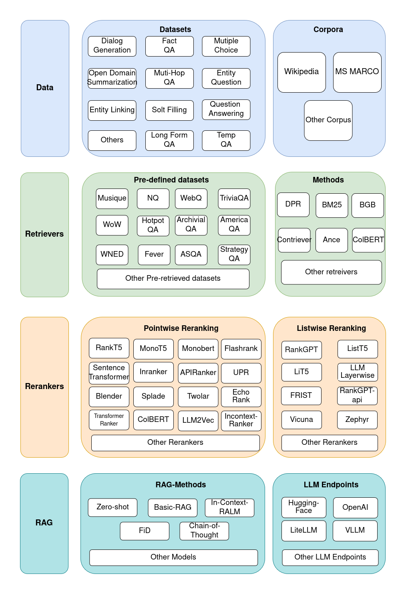

[ [English](README.md) | [中文](README_zh.md)]
# <p align="center"></p>
### <div align="center">🔥 Rankify: 一个全面的 Python 工具包，专为检索、重排序和检索增强生成（RAG）设计 🔥<div>

> 📢 特别感谢 [Xiumao](https://github.com/xiumaoprompt) 对 Rankify 的大力支持与推广！  
> 以下是他撰写的两篇精彩中文解析文章，为用户更好理解 Rankify 提供了重要帮助：
>
> - 📘 [Rankify 入门解析：如何构建统一检索与重排序框架](https://mp.weixin.qq.com/s/-dH64Q_KWvj8VQq7Ys383Q)  
> - 📘 [再探 Rankify：理解不同重排序模型的原理与应用](https://mp.weixin.qq.com/s/XcOmXGv4CqUIp0oBcOgltw)  

---

<div align="center">
<a href="https://arxiv.org/abs/2502.02464" target="_blank"></a>
<a href="https://huggingface.co/datasets/abdoelsayed/reranking-datasets" target="_blank"></a>
<a href="https://huggingface.co/datasets/abdoelsayed/reranking-datasets-light" target="_blank"></a>
<a></a>
<a href="https://opensource.org/license/apache-2-0"></a>
 <a href="https://pepy.tech/projects/rankify"></a>
<a href="https://github.com/DataScienceUIBK/rankify/releases"></a>  
<a href="https://star-history.com/#DataScienceUIBK/Rankify">  </a>  

 [](https://gitcode.com/abdoelsayed2016/Rankify)

</div>

如果你喜欢我们的框架，**请不要犹豫，⭐ 给这个仓库加星 ⭐**。这将帮助我们**使 Rankify 变得更强大，并扩展到更多模型和方法 🤗**。


---

_一个模块化且高效的检索、重排序和 RAG 框架，专为最新的检索、排序和 RAG 任务模型设计。_

_Rankify 是一个 Python 工具包，专为统一的检索、重排序和检索增强生成（RAG）研究而构建。该工具包集成了 40 个预检索的基准数据集，支持 7 种检索技术，包含 24 种最先进的重排序模型，并支持多种 RAG 方法。Rankify 提供一个模块化且可扩展的框架，使研究人员和实践者能够轻松进行实验和基准测试，涵盖完整的检索流程。详细的文档、开源实现和预构建的评估工具，使 Rankify 成为该领域研究者和工程师的强大工具。_

<p align="center">

</p>

---
## 🚀 演示

要在本地运行演示，请执行以下操作：

```bash
# 确保已安装 Rankify
pip install streamlit

# 然后运行演示
streamlit run demo.py
```


https://github.com/user-attachments/assets/13184943-55db-4f0c-b509-fde920b809bc

---
## :sparkles: 特性

- **全面的检索与重排序框架**：Rankify 将检索、重排序和检索增强生成（RAG）整合为一个模块化的 Python 工具包，支持无缝实验和基准测试。  

- **广泛的数据集支持**：包含 **40 个基准数据集**，提供 **预检索文档**，涵盖 **问答、对话、实体链接和事实验证**等多个领域。  

- **多样化的检索器集成**：支持 **7 种检索技术**，包括 **BM25、DPR、ANCE、BPR、ColBERT、BGE 和 Contriever**，提供灵活的检索策略选择。  

- **先进的重排序模型**：实现 **24 种主流重排序模型** 和 **41 种子方法**，涵盖 **点对、对对（pairwise）、列表级（listwise）** 重排序方法，以提升排名性能。  

- **预构建检索索引**：提供 **预计算的 Wikipedia 和 MS MARCO 语料库**，适用于多种检索模型，减少索引开销，加速实验进程。  

- **无缝 RAG 集成**：连接检索与生成模型（如 **GPT、LLAMA、T5**），支持 **零样本（zero-shot）**、**解码器融合（Fusion-in-Decoder，FiD）** 和 **上下文学习（in-context learning）** 等 RAG 生成策略。  

- **模块化 & 可扩展设计**：通过 Rankify 结构化的 Python API，轻松集成自定义数据集、检索器、重排序模型和生成模型。  

- **全面的评估套件**：提供 **自动化性能评估**，涵盖 **检索、排序和 RAG 评测指标**，确保可复现的基准测试。  

- **用户友好的文档支持**：提供详细的 **[📖 在线文档](http://rankify.readthedocs.io/)**、示例笔记本和教程，便于快速上手。  

## 🔍 发展路线图  

**Rankify** 仍在积极开发中，目前已发布首个版本（**v0.1.0**）。尽管当前已支持多种检索、重排序和 RAG 技术，我们仍在不断增强其功能，计划增加更多的检索器、排序器、数据集和特性。  

### 🚀 计划改进  

- **检索器（Retrievers）**  
  - [x] 支持 **BM25、DPR、ANCE、BPR、ColBERT、BGE 和 Contriever**  
  - [ ] 添加缺失的检索器：**Spar、MSS、MSS-DPR**  
  - [ ] 支持 **自定义索引加载**，允许用户定义检索语料库  

- **重排序器（Re-Rankers）**  
  - [x] 24 种主流重排序模型，包含 41 种子方法  
  - [ ] 扩展支持，添加 **更先进的排序模型**  

- **数据集（Datasets）**  
  - [x] 提供 40 个用于检索、排序和 RAG 的基准数据集  
  - [ ] 增加 **更多数据集**  
  - [ ] 支持 **自定义数据集集成**  

- **检索增强生成（RAG）**  
  - [x] 已集成 **GPT、LLAMA 和 T5**  
  - [ ] 扩展支持 **更多生成模型**  

- **评估与可用性（Evaluation & Usability）**  
  - [x] 提供标准的检索与排序评估指标（Top-K、EM、Recall...）  
  - [ ] 增加 **更高级的评估指标**（如 NDCG、MAP 用于检索器评估）  

- **流程集成（Pipeline Integration）**  
  - [ ] **新增流水线模块**，简化检索、重排序和 RAG 工作流  

## 🔧 安装指南  

#### 设置虚拟环境  
首先，使用 Python 3.10 创建并激活 conda 环境：  

```bash
conda create -n rankify python=3.10
conda activate rankify
```
#### 安装 PyTorch 2.5.1
我们推荐使用 PyTorch 2.5.1 来安装 Rankify。请参考 [PyTorch installation page](https://pytorch.org/get-started/previous-versions/) 获取特定平台的安装命令。

如果你可以使用 GPU，我们建议安装支持 CUDA 12.4 或 12.6 版本的 PyTorch，因为许多评估指标已针对 GPU 进行了优化。

安装 PyTorch 2.5.1，可使用以下命令：
```bash
pip install torch==2.5.1 torchvision==0.20.1 torchaudio==2.5.1 --index-url https://download.pytorch.org/whl/cu124
```
#### 基本安装
要安装 Rankify，只需使用 pip（要求 Python 3.10 及以上版本）：
```base
pip install rankify
```

此命令将安装 Rankify 的基本功能，包括检索、重排序和检索增强生成（RAG）。

#### 推荐安装方式
为了获得完整功能，推荐安装 Rankify 及所有依赖项：

```bash
pip install "rankify[all]"
```
这将确保所有必要的模块，包括检索、重排序和 RAG 支持，均已安装。

#### 可选依赖项
如果你只想安装特定组件，可使用以下命令：

```bash
# 仅安装检索相关依赖（支持 BM25、DPR、ANCE 等）
pip install "rankify[retriever]"

# 安装基础重排序组件，包括 vLLM 支持的 `FirstModelReranker`、`LiT5ScoreReranker`、`LiT5DistillReranker`、`VicunaReranker` 和 `ZephyrReranker`
pip install "rankify[reranking]"
```

从 GitHub 安装最新开发版本
如果希望获取最新的开发版本，可从 GitHub 进行安装：


```bash
git clone https://github.com/DataScienceUIBK/rankify.git
cd rankify
pip install -e .
# 安装所有依赖项（推荐）
pip install -e ".[all]"
# 仅安装检索相关依赖
pip install -e ".[retriever]"
# 仅安装重排序相关依赖
pip install -e ".[reranking]"
```
#### 使用 ColBERT 检索器
如果你想使用 ColBERT 检索器，请按照以下步骤进行额外设置：

```bash
# 安装 GCC 和必要的库
conda install -c conda-forge gcc=9.4.0 gxx=9.4.0
conda install -c conda-forge libstdcxx-ng
```
```bash
# 导出必要的环境变量
export LD_LIBRARY_PATH=$CONDA_PREFIX/lib:$LD_LIBRARY_PATH
export CC=gcc
export CXX=g++
export PATH=$CONDA_PREFIX/bin:$PATH

# 清除缓存的 Torch 扩展
rm -rf ~/.cache/torch_extensions/*
```
---
## :rocket: 快速开始

### **1️⃣ 预检索数据集**  

我们提供 **每个数据集 1,000 条预检索文档**，你可以从以下链接下载：  

🔗 **[Hugging Face 数据集仓库](https://huggingface.co/datasets/abdoelsayed/reranking-datasets-light)**  

#### **数据集格式**  

预检索的文档结构如下：
```json
[
    {
        "question": "...",
        "answers": ["...", "...", ...],
        "ctxs": [
            {
                "id": "...",         // 数据库 TSV 文件中的段落 ID
                "score": "...",      // 检索器分数
                "has_answer": true|false  // 该段落是否包含正确答案
            }
        ]
    }
]
```

#### **在 Rankify 中访问数据集**  

你可以通过 **Rankify** **轻松下载和使用预检索数据集**。  

#### **列出可用数据集**  

要查看所有可用的数据集，请运行以下代码：
```python
from rankify.dataset.dataset import Dataset 

# 显示可用数据集
Dataset.available_dataset()
```


**BM25 检索器数据集**
```python
from rankify.dataset.dataset import Dataset

# 下载 nq-dev 数据集的 BM25 检索文档
dataset = Dataset(retriever="bm25", dataset_name="nq-dev", n_docs=100)
documents = dataset.download(force_download=False)

# 下载 2wikimultihopqa-train 数据集的 BM25 检索文档
dataset = Dataset(retriever="bm25", dataset_name="2wikimultihopqa-train", n_docs=100)
documents = dataset.download(force_download=False)

# 下载 archivialqa-dev 数据集的 BM25 检索文档
dataset = Dataset(retriever="bm25", dataset_name="archivialqa-dev", n_docs=100)
documents = dataset.download(force_download=False)

# 下载 archivialqa-test 数据集的 BM25 检索文档
dataset = Dataset(retriever="bm25", dataset_name="archivialqa-test", n_docs=100)
documents = dataset.download(force_download=False)

# 下载 chroniclingamericaqa-test 数据集的 BM25 检索文档
dataset = Dataset(retriever="bm25", dataset_name="chroniclingamericaqa-test", n_docs=100)
documents = dataset.download(force_download=False)

# 下载 chroniclingamericaqa-dev 数据集的 BM25 检索文档
dataset = Dataset(retriever="bm25", dataset_name="chroniclingamericaqa-dev", n_docs=100)
documents = dataset.download(force_download=False)

# 下载 entityquestions-test 数据集的 BM25 检索文档
dataset = Dataset(retriever="bm25", dataset_name="entityquestions-test", n_docs=100)
documents = dataset.download(force_download=False)

# 下载 ambig_qa-dev 数据集的 BM25 检索文档
dataset = Dataset(retriever="bm25", dataset_name="ambig_qa-dev", n_docs=100)
documents = dataset.download(force_download=False)

# 下载 ambig_qa-train 数据集的 BM25 检索文档
dataset = Dataset(retriever="bm25", dataset_name="ambig_qa-train", n_docs=100)
documents = dataset.download(force_download=False)

# 下载 arc-test 数据集的 BM25 检索文档
dataset = Dataset(retriever="bm25", dataset_name="arc-test", n_docs=100)
documents = dataset.download(force_download=False)

# 下载 arc-dev 数据集的 BM25 检索文档
dataset = Dataset(retriever="bm25", dataset_name="arc-dev", n_docs=100)
documents = dataset.download(force_download=False)
```

**BGE 检索器数据集**
```python
from rankify.dataset.dataset import Dataset

# 下载 nq-dev 数据集的 BGE 检索文档
dataset = Dataset(retriever="bge", dataset_name="nq-dev", n_docs=100)
documents = dataset.download(force_download=False)

# 下载 2wikimultihopqa-train 数据集的 BGE 检索文档
dataset = Dataset(retriever="bge", dataset_name="2wikimultihopqa-train", n_docs=100)
documents = dataset.download(force_download=False)

# 下载 archivialqa-dev 数据集的 BGE 检索文档
dataset = Dataset(retriever="bge", dataset_name="archivialqa-dev", n_docs=100)
documents = dataset.download(force_download=False)
```

**ColBERT 检索器数据集**
```python
from rankify.dataset.dataset import Dataset

# 下载 nq-dev 数据集的 ColBERT 检索文档
dataset = Dataset(retriever="colbert", dataset_name="nq-dev", n_docs=100)
documents = dataset.download(force_download=False)

# 下载 2wikimultihopqa-train 数据集的 ColBERT 检索文档
dataset = Dataset(retriever="colbert", dataset_name="2wikimultihopqa-train", n_docs=100)
documents = dataset.download(force_download=False)

# 下载 archivialqa-dev 数据集的 ColBERT 检索文档
dataset = Dataset(retriever="colbert", dataset_name="archivialqa-dev", n_docs=100)
documents = dataset.download(force_download=False)
```

**MSS-DPR 检索器数据集**
```python
from rankify.dataset.dataset import Dataset

# 下载 nq-dev 数据集的 MSS-DPR 检索文档
dataset = Dataset(retriever="mss-dpr", dataset_name="nq-dev", n_docs=100)
documents = dataset.download(force_download=False)

# 下载 2wikimultihopqa-train 数据集的 MSS-DPR 检索文档
dataset = Dataset(retriever="mss-dpr", dataset_name="2wikimultihopqa-train", n_docs=100)
documents = dataset.download(force_download=False)

# 下载 archivialqa-dev 数据集的 MSS-DPR 检索文档
dataset = Dataset(retriever="mss-dpr", dataset_name="archivialqa-dev", n_docs=100)
documents = dataset.download(force_download=False)
```

**MSS 检索器数据集**
```python
from rankify.dataset.dataset import Dataset

# 下载 nq-dev 数据集的 MSS 检索文档
dataset = Dataset(retriever="mss", dataset_name="nq-dev", n_docs=100)
documents = dataset.download(force_download=False)

# 下载 2wikimultihopqa-train 数据集的 MSS 检索文档
dataset = Dataset(retriever="mss", dataset_name="2wikimultihopqa-train", n_docs=100)
documents = dataset.download(force_download=False)

# 下载 archivialqa-dev 数据集的 MSS 检索文档
dataset = Dataset(retriever="mss", dataset_name="archivialqa-dev", n_docs=100)
documents = dataset.download(force_download=False)
```

**Contriever 检索器数据集**
```python
from rankify.dataset.dataset import Dataset

# 下载 nq-dev 数据集的 Contriever 检索文档
dataset = Dataset(retriever="contriever", dataset_name="nq-dev", n_docs=100)
documents = dataset.download(force_download=False)

# 下载 2wikimultihopqa-train 数据集的 Contriever 检索文档
dataset = Dataset(retriever="contriever", dataset_name="2wikimultihopqa-train", n_docs=100)
documents = dataset.download(force_download=False)

# 下载 archivialqa-dev 数据集的 Contriever 检索文档
dataset = Dataset(retriever="contriever", dataset_name="archivialqa-dev", n_docs=100)
documents = dataset.download(force_download=False)
```

**ANCE 检索器数据集**
```python
from rankify.dataset.dataset import Dataset

# 下载 nq-dev 数据集的 ANCE 检索文档
dataset = Dataset(retriever="ance", dataset_name="nq-dev", n_docs=100)
documents = dataset.download(force_download=False)

# 下载 2wikimultihopqa-train 数据集的 ANCE 检索文档
dataset = Dataset(retriever="ance", dataset_name="2wikimultihopqa-train", n_docs=100)
documents = dataset.download(force_download=False)

# 下载 archivialqa-dev 数据集的 ANCE 检索文档
dataset = Dataset(retriever="ance", dataset_name="archivialqa-dev", n_docs=100)
documents = dataset.download(force_download=False)
```

**从文件加载预检索数据集**  

如果你已经下载了数据集，可以直接加载它：  
```python
from rankify.dataset.dataset import Dataset

# 加载已下载的 WebQuestions 数据集（BM25 检索结果）
documents = Dataset.load_dataset('./tests/out-datasets/bm25/web_questions/test.json', 100)
```
现在，你可以将 检索文档 与 重排序 和 RAG 工作流集成！🚀

#### 预检索数据集的特性比较

下表概述了每个数据集在不同检索方法（**BM25、DPR、ColBERT、ANCE、BGE、Contriever**）的可用性。

✅ **已完成**  
🕒 **待处理**  

<table style="width: 100%;">
  <tr>
    <th align="center">数据集</th> 
    <th align="center">BM25</th> 
    <th align="center">DPR</th> 
    <th align="center">ColBERT</th>
    <th align="center">ANCE</th>
    <th align="center">BGE</th>
    <th align="center">Contriever</th>
  </tr>
  <tr>
    <td align="left">2WikimultihopQA</td>
    <td align="center">✅</td>
    <td align="center">🕒</td>
    <td align="center">🕒</td>
    <td align="center">🕒</td>
    <td align="center">🕒</td>
    <td align="center">🕒</td>
  </tr>
  <tr>
    <td align="left">ArchivialQA</td>
    <td align="center">✅</td>
    <td align="center">🕒</td>
    <td align="center">🕒</td>
    <td align="center">🕒</td>
    <td align="center">🕒</td>
    <td align="center">🕒</td>
  </tr>
  <tr>
    <td align="left">ChroniclingAmericaQA</td>
    <td align="center">✅</td>
    <td align="center">🕒</td>
    <td align="center">🕒</td>
    <td align="center">🕒</td>
    <td align="center">🕒</td>
    <td align="center">🕒</td>
  </tr>
  <tr>
    <td align="left">EntityQuestions</td>
    <td align="center">✅</td>
    <td align="center">🕒</td>
    <td align="center">🕒</td>
    <td align="center">🕒</td>
    <td align="center">🕒</td>
    <td align="center">🕒</td>
  </tr>
  <tr>
    <td align="left">AmbigQA</td>
    <td align="center">✅</td>
    <td align="center">🕒</td>
    <td align="center">🕒</td>
    <td align="center">🕒</td>
    <td align="center">🕒</td>
    <td align="center">🕒</td>
  </tr>
  <tr>
    <td align="left">ARC</td>
    <td align="center">✅</td>
    <td align="center">🕒</td>
    <td align="center">🕒</td>
    <td align="center">🕒</td>
    <td align="center">🕒</td>
    <td align="center">🕒</td>
  </tr>
  <tr>
    <td align="left">ASQA</td>
    <td align="center">✅</td>
    <td align="center">🕒</td>
    <td align="center">🕒</td>
    <td align="center">🕒</td>
    <td align="center">🕒</td>
    <td align="center">🕒</td>
  </tr>
  <tr>
    <td align="left">MS MARCO</td>
    <td align="center">🕒</td>
    <td align="center">🕒</td>
    <td align="center">🕒</td>
    <td align="center">🕒</td>
    <td align="center">🕒</td>
    <td align="center">🕒</td>
  </tr>
  <tr>
    <td align="left">AY2</td>
    <td align="center">✅</td>
    <td align="center">🕒</td>
    <td align="center">🕒</td>
    <td align="center">🕒</td>
    <td align="center">🕒</td>
    <td align="center">🕒</td>
  </tr>
  <tr>
    <td align="left">Bamboogle</td>
    <td align="center">✅</td>
    <td align="center">🕒</td>
    <td align="center">🕒</td>
    <td align="center">🕒</td>
    <td align="center">🕒</td>
    <td align="center">🕒</td>
  </tr>
  <tr>
    <td align="left">BoolQ</td>
    <td align="center">✅</td>
    <td align="center">🕒</td>
    <td align="center">🕒</td>
    <td align="center">🕒</td>
    <td align="center">🕒</td>
    <td align="center">🕒</td>
  </tr>
  <tr>
    <td align="left">CommonSenseQA</td>
    <td align="center">✅</td>
    <td align="center">🕒</td>
    <td align="center">🕒</td>
    <td align="center">🕒</td>
    <td align="center">🕒</td>
    <td align="center">🕒</td>
  </tr>
  <tr>
    <td align="left">CuratedTREC</td>
    <td align="center">✅</td>
    <td align="center">🕒</td>
    <td align="center">🕒</td>
    <td align="center">🕒</td>
    <td align="center">🕒</td>
    <td align="center">🕒</td>
  </tr>
  <tr>
    <td align="left">ELI5</td>
    <td align="center">✅</td>
    <td align="center">🕒</td>
    <td align="center">🕒</td>
    <td align="center">🕒</td>
    <td align="center">🕒</td>
    <td align="center">🕒</td>
  </tr>
  <tr>
    <td align="left">FERMI</td>
    <td align="center">✅</td>
    <td align="center">🕒</td>
    <td align="center">🕒</td>
    <td align="center">🕒</td>
    <td align="center">🕒</td>
    <td align="center">🕒</td>
  </tr>
  <tr>
    <td align="left">FEVER</td>
    <td align="center">✅</td>
    <td align="center">🕒</td>
    <td align="center">🕒</td>
    <td align="center">🕒</td>
    <td align="center">🕒</td>
    <td align="center">🕒</td>
  </tr>
  <tr>
    <td align="left">HellaSwag</td>
    <td align="center">✅</td>
    <td align="center">🕒</td>
    <td align="center">🕒</td>
    <td align="center">🕒</td>
    <td align="center">🕒</td>
    <td align="center">🕒</td>
  </tr>
  <tr>
    <td align="left">HotpotQA</td>
    <td align="center">✅</td>
    <td align="center">🕒</td>
    <td align="center">🕒</td>
    <td align="center">🕒</td>
    <td align="center">🕒</td>
    <td align="center">🕒</td>
  </tr>
  <tr>
    <td align="left">MMLU</td>
    <td align="center">✅</td>
    <td align="center">🕒</td>
    <td align="center">🕒</td>
    <td align="center">🕒</td>
    <td align="center">🕒</td>
    <td align="center">🕒</td>
  </tr>
  <tr>
    <td align="left">Musique</td>
    <td align="center">✅</td>
    <td align="center">🕒</td>
    <td align="center">🕒</td>
    <td align="center">🕒</td>
    <td align="center">🕒</td>
    <td align="center">🕒</td>
  </tr>
    <tr>
    <td align="left">NarrativeQA</td>
    <td align="center">✅</td>
    <td align="center">🕒</td>
    <td align="center">🕒</td>
    <td align="center">🕒</td>
    <td align="center">🕒</td>
    <td align="center">🕒</td>
  </tr>
    <tr>
    <td align="left">NQ</td>
    <td align="center">✅</td>
    <td align="center">🕒</td>
    <td align="center">🕒</td>
    <td align="center">🕒</td>
    <td align="center">🕒</td>
    <td align="center">🕒</td>
  </tr>
    <tr>
    <td align="left">OpenbookQA</td>
    <td align="center">✅</td>
    <td align="center">🕒</td>
    <td align="center">🕒</td>
    <td align="center">🕒</td>
    <td align="center">🕒</td>
    <td align="center">🕒</td>
  </tr>
    <tr>
    <td align="left">PIQA</td>
    <td align="center">✅</td>
    <td align="center">🕒</td>
    <td align="center">🕒</td>
    <td align="center">🕒</td>
    <td align="center">🕒</td>
    <td align="center">🕒</td>
  </tr>
    <tr>
    <td align="left">PopQA</td>
    <td align="center">✅</td>
    <td align="center">🕒</td>
    <td align="center">🕒</td>
    <td align="center">🕒</td>
    <td align="center">🕒</td>
    <td align="center">🕒</td>
  </tr>
    <tr>
    <td align="left">Quartz</td>
    <td align="center">✅</td>
    <td align="center">🕒</td>
    <td align="center">🕒</td>
    <td align="center">🕒</td>
    <td align="center">🕒</td>
    <td align="center">🕒</td>
  </tr>
    <tr>
    <td align="left">SIQA</td>
    <td align="center">✅</td>
    <td align="center">🕒</td>
    <td align="center">🕒</td>
    <td align="center">🕒</td>
    <td align="center">🕒</td>
    <td align="center">🕒</td>
  </tr>
    <tr>
    <td align="left">StrategyQA</td>
    <td align="center">✅</td>
    <td align="center">🕒</td>
    <td align="center">🕒</td>
    <td align="center">🕒</td>
    <td align="center">🕒</td>
    <td align="center">🕒</td>
  </tr>
    </tr>
    <tr>
    <td align="left">TREX</td>
    <td align="center">✅</td>
    <td align="center">🕒</td>
    <td align="center">🕒</td>
    <td align="center">🕒</td>
    <td align="center">🕒</td>
    <td align="center">🕒</td>
  </tr>
    </tr>
    <tr>
    <td align="left">TriviaQA</td>
    <td align="center">✅</td>
    <td align="center">🕒</td>
    <td align="center">🕒</td>
    <td align="center">🕒</td>
    <td align="center">🕒</td>
    <td align="center">🕒</td>
  </tr>
    </tr>
    <tr>
    <td align="left">TruthfulQA</td>
    <td align="center">✅</td>
    <td align="center">🕒</td>
    <td align="center">🕒</td>
    <td align="center">🕒</td>
    <td align="center">🕒</td>
    <td align="center">🕒</td>
  </tr>
      </tr>
    <tr>
    <td align="left">TruthfulQA</td>
    <td align="center">✅</td>
    <td align="center">🕒</td>
    <td align="center">🕒</td>
    <td align="center">🕒</td>
    <td align="center">🕒</td>
    <td align="center">🕒</td>
  </tr>
      </tr>
    <tr>
    <td align="left">WebQ</td>
    <td align="center">✅</td>
    <td align="center">🕒</td>
    <td align="center">🕒</td>
    <td align="center">🕒</td>
    <td align="center">🕒</td>
    <td align="center">🕒</td>
  </tr>
      </tr>
    <tr>
    <td align="left">WikiQA</td>
    <td align="center">✅</td>
    <td align="center">🕒</td>
    <td align="center">🕒</td>
    <td align="center">🕒</td>
    <td align="center">🕒</td>
    <td align="center">🕒</td>
  </tr>
      </tr>
    <tr>
    <td align="left">WikiAsp</td>
    <td align="center">✅</td>
    <td align="center">🕒</td>
    <td align="center">🕒</td>
    <td align="center">🕒</td>
    <td align="center">🕒</td>
    <td align="center">🕒</td>
  </tr>
        </tr>
    <tr>
    <td align="left">WikiPassageQA</td>
    <td align="center">✅</td>
    <td align="center">🕒</td>
    <td align="center">🕒</td>
    <td align="center">🕒</td>
    <td align="center">🕒</td>
    <td align="center">🕒</td>
  </tr>
        </tr>
    <tr>
    <td align="left">WNED</td>
    <td align="center">✅</td>
    <td align="center">🕒</td>
    <td align="center">🕒</td>
    <td align="center">🕒</td>
    <td align="center">🕒</td>
    <td align="center">🕒</td>
  </tr>
        </tr>
    <tr>
    <td align="left">WoW</td>
    <td align="center">✅</td>
    <td align="center">🕒</td>
    <td align="center">🕒</td>
    <td align="center">🕒</td>
    <td align="center">🕒</td>
    <td align="center">🕒</td>
  </tr>
        </tr>
    <tr>
    <td align="left">Zsre</td>
    <td align="center">✅</td>
    <td align="center">🕒</td>
    <td align="center">🕒</td>
    <td align="center">🕒</td>
    <td align="center">🕒</td>
    <td align="center">🕒</td>
  </tr>
</table>

---

### 2️⃣ 运行检索
使用 **Rankify** 进行检索时，您可以选择多种检索方法，例如 **BM25、DPR、ANCE、Contriever、ColBERT 和 BGE**。

**示例：对示例查询运行检索**
```python
from rankify.dataset.dataset import Document, Question, Answer, Context
from rankify.retrievers.retriever import Retriever

# 示例文档
documents = [
    Document(question=Question("《虎胆龙威5》的演员阵容？"), answers=Answer([
            "Jai Courtney",
            "Sebastian Koch",
            "Radivoje Bukvić",
            "Yuliya Snigir",
            "Sergei Kolesnikov",
            "Mary Elizabeth Winstead",
            "Bruce Willis"
        ]), contexts=[]),
    Document(question=Question("《哈姆雷特》的作者是谁？"), answers=Answer(["莎士比亚"]), contexts=[])
]
```

```python
# 在 Wikipedia 上使用 BM25 进行检索
bm25_retriever_wiki = Retriever(method="bm25", n_docs=5, index_type="wiki")

# 在 MS MARCO 上使用 BM25 进行检索
bm25_retriever_msmacro = Retriever(method="bm25", n_docs=5, index_type="msmarco")


# 在 Wikipedia 上使用 DPR（多编码器）进行检索
dpr_retriever_wiki = Retriever(method="dpr", model="dpr-multi", n_docs=5, index_type="wiki")

# 在 MS MARCO 上使用 DPR（多编码器）进行检索
dpr_retriever_msmacro = Retriever(method="dpr", model="dpr-multi", n_docs=5, index_type="msmarco")

# 在 Wikipedia 上使用 DPR（单编码器）进行检索
dpr_retriever_wiki = Retriever(method="dpr", model="dpr-single", n_docs=5, index_type="wiki")

# 在 MS MARCO 上使用 DPR（单编码器）进行检索
dpr_retriever_msmacro = Retriever(method="dpr", model="dpr-single", n_docs=5, index_type="msmarco")

# 在 Wikipedia 上使用 ANCE 进行检索
ance_retriever_wiki = Retriever(method="ance", model="ance-multi", n_docs=5, index_type="wiki")

# 在 MS MARCO 上使用 ANCE 进行检索
ance_retriever_msmacro = Retriever(method="ance", model="ance-multi", n_docs=5, index_type="msmarco")


# 在 Wikipedia 上使用 Contriever 进行检索
contriever_retriever_wiki = Retriever(method="contriever", model="facebook/contriever-msmarco", n_docs=5, index_type="wiki")

# 在 MS MARCO 上使用 Contriever 进行检索
contriever_retriever_msmacro = Retriever(method="contriever", model="facebook/contriever-msmarco", n_docs=5, index_type="msmarco")


# 在 Wikipedia 上使用 ColBERT 进行检索
colbert_retriever_wiki = Retriever(method="colbert", model="colbert-ir/colbertv2.0", n_docs=5, index_type="wiki")

# 在 MS MARCO 上使用 ColBERT 进行检索
colbert_retriever_msmacro = Retriever(method="colbert", model="colbert-ir/colbertv2.0", n_docs=5, index_type="msmarco")


# 在 Wikipedia 上使用 BGE 进行检索
bge_retriever_wiki = Retriever(method="bge", model="BAAI/bge-large-en-v1.5", n_docs=5, index_type="wiki")

# 在 MS MARCO 上使用 BGE 进行检索
bge_retriever_msmacro = Retriever(method="bge", model="BAAI/bge-large-en-v1.5", n_docs=5, index_type="msmarco")
```

**运行检索**

定义检索器后，可以使用以下代码检索文档：
```python
retrieved_documents = bm25_retriever_wiki.retrieve(documents)

for i, doc in enumerate(retrieved_documents):
    print(f"\n文档 {i+1}:")
    print(doc)
```

---

## 3️⃣ 运行重排序（Reranking）
Rankify 支持多种重排序模型。以下是使用每种模型的示例。

**示例：对文档进行重排序**
```python
from rankify.dataset.dataset import Document, Question, Answer, Context
from rankify.models.reranking import Reranking

# 示例文档设置
question = Question("托马斯·爱迪生何时发明了灯泡？")
answers = Answer(["1879"])
contexts = [
    Context(text="首尔国立大学发生雷击事件", id=1),
    Context(text="托马斯·爱迪生曾尝试为汽车发明一种装置，但失败了", id=2),
    Context(text="咖啡有助于减肥", id=3),
    Context(text="托马斯·爱迪生于 1879 年发明了灯泡", id=4),
    Context(text="托马斯·爱迪生研究电力", id=5),
]
document = Document(question=question, answers=answers, contexts=contexts)

# 初始化重排序器
reranker = Reranking(method="monot5", model_name="monot5-base-msmarco")

# 进行重排序
reranker.rank([document])

# 输出重新排序的上下文
for context in document.reorder_contexts:
    print(f"  - {context.text}")
```

**使用不同重排序模型的示例**
```python
# UPR
model = Reranking(method='upr', model_name='t5-base')

# 基于 API 的重排序器
model = Reranking(method='apiranker', model_name='voyage', api_key='your-api-key')
model = Reranking(method='apiranker', model_name='jina', api_key='your-api-key')
model = Reranking(method='apiranker', model_name='mixedbread.ai', api_key='your-api-key')

# Blender Reranker
model = Reranking(method='blender_reranker', model_name='PairRM')

# ColBERT Reranker
model = Reranking(method='colbert_ranker', model_name='Colbert')

# EchoRank
model = Reranking(method='echorank', model_name='flan-t5-large')

# First Ranker
model = Reranking(method='first_ranker', model_name='base')

# FlashRank
model = Reranking(method='flashrank', model_name='ms-marco-TinyBERT-L-2-v2')

# InContext Reranker
Reranking(method='incontext_reranker', model_name='llamav3.1-8b')

# InRanker
model = Reranking(method='inranker', model_name='inranker-small')

# ListT5
model = Reranking(method='listt5', model_name='listt5-base')

# LiT5 Distill
model = Reranking(method='lit5distill', model_name='LiT5-Distill-base')

# LiT5 Score
model = Reranking(method='lit5score', model_name='LiT5-Distill-base')

# LLM Layerwise Ranker
model = Reranking(method='llm_layerwise_ranker', model_name='bge-multilingual-gemma2')

# LLM2Vec
model = Reranking(method='llm2vec', model_name='Meta-Llama-31-8B')

# MonoBERT
model = Reranking(method='monobert', model_name='monobert-large')

# MonoT5
Reranking(method='monot5', model_name='monot5-base-msmarco')

# RankGPT
model = Reranking(method='rankgpt', model_name='llamav3.1-8b')

# RankGPT API
model = Reranking(method='rankgpt-api', model_name='gpt-3.5', api_key="gpt-api-key")
model = Reranking(method='rankgpt-api', model_name='gpt-4', api_key="gpt-api-key")
model = Reranking(method='rankgpt-api', model_name='llamav3.1-8b', api_key="together-api-key")
model = Reranking(method='rankgpt-api', model_name='claude-3-5', api_key="claude-api-key")

# RankT5
model = Reranking(method='rankt5', model_name='rankt5-base')

# Sentence Transformer Reranker
model = Reranking(method='sentence_transformer_reranker', model_name='all-MiniLM-L6-v2')
model = Reranking(method='sentence_transformer_reranker', model_name='gtr-t5-base')
model = Reranking(method='sentence_transformer_reranker', model_name='sentence-t5-base')
model = Reranking(method='sentence_transformer_reranker', model_name='distilbert-multilingual-nli-stsb-quora-ranking')
model = Reranking(method='sentence_transformer_reranker', model_name='msmarco-bert-co-condensor')

# SPLADE
model = Reranking(method='splade', model_name='splade-cocondenser')

# Transformer Ranker
model = Reranking(method='transformer_ranker', model_name='mxbai-rerank-xsmall')
model = Reranking(method='transformer_ranker', model_name='bge-reranker-base')
model = Reranking(method='transformer_ranker', model_name='bce-reranker-base')
model = Reranking(method='transformer_ranker', model_name='jina-reranker-tiny')
model = Reranking(method='transformer_ranker', model_name='gte-multilingual-reranker-base')
model = Reranking(method='transformer_ranker', model_name='nli-deberta-v3-large')
model = Reranking(method='transformer_ranker', model_name='ms-marco-TinyBERT-L-6')
model = Reranking(method='transformer_ranker', model_name='msmarco-MiniLM-L12-en-de-v1')

# TwoLAR
model = Reranking(method='twolar', model_name='twolar-xl')

# Vicuna Reranker
model = Reranking(method='vicuna_reranker', model_name='rank_vicuna_7b_v1')

# Zephyr Reranker
model = Reranking(method='zephyr_reranker', model_name='rank_zephyr_7b_v1_full')
```
---

## 4️⃣ 使用生成器模块
Rankify 提供了一个 **生成器模块**，用于 **检索增强生成 (RAG)**，将检索到的文档集成到生成模型中，以生成答案。以下是如何使用不同生成方法的示例。

```python
from rankify.dataset.dataset import Document, Question, Answer, Context
from rankify.generator.generator import Generator

# 定义问题和答案
question = Question("法国的首都是哪里？")
answers = Answer(["巴黎"])
contexts = [
    Context(id=1, title="法国", text="法国的首都是巴黎。", score=0.9),
    Context(id=2, title="德国", text="柏林是德国的首都。", score=0.5)
]

# 构造文档
doc = Document(question=question, answers=answers, contexts=contexts)

# 初始化生成器（例如 Meta Llama）
generator = Generator(method="in-context-ralm", model_name='meta-llama/Llama-3.1-8B')

# 生成答案
generated_answers = generator.generate([doc])
print(generated_answers)  # 输出: ["巴黎"]
```

---

## 5️⃣ 使用指标进行评估  

Rankify 提供了内置的 **评估指标**，用于 **检索、重排名和检索增强生成 (RAG)**。这些指标有助于评估检索文档的质量、排名模型的有效性以及生成答案的准确性。

**评估生成的答案**  

您可以通过将生成的答案与真实答案进行比较来评估 **检索增强生成 (RAG) 结果** 的质量。

```python
from rankify.metrics.metrics import Metrics
from rankify.dataset.dataset import Dataset

# 加载数据集
dataset = Dataset('bm25', 'nq-test', 100)
documents = dataset.download(force_download=False)

# 初始化生成器
generator = Generator(method="in-context-ralm", model_name='meta-llama/Llama-3.1-8B')

# 生成答案
generated_answers = generator.generate(documents)

# 评估生成的答案
metrics = Metrics(documents)
print(metrics.calculate_generation_metrics(generated_answers))
```

**评估检索性能**  

```python
# 计算重排序前的检索指标
metrics = Metrics(documents)
before_ranking_metrics = metrics.calculate_retrieval_metrics(ks=[1, 5, 10, 20, 50, 100], use_reordered=False)

print(before_ranking_metrics)
```
评估重排序结果
```python
# 计算重排序后的检索指标
after_ranking_metrics = metrics.calculate_retrieval_metrics(ks=[1, 5, 10, 20, 50, 100], use_reordered=True)
print(after_ranking_metrics)
```


## 📜 支持的模型

### **1️⃣ 检索器（Retrievers）**  
- ✅ **BM25**
- ✅ **DPR** 
- ✅ **ColBERT**   
- ✅ **ANCE**
- ✅ **BGE** 
- ✅ **Contriever** 
- ✅ **BPR** 
- 🕒 **Spar**   
- 🕒 **Dragon** 
- 🕒 **Hybird** 
---

### **2️⃣ 重新排序器（Rerankers）**  

- ✅ **交叉编码器（Cross-Encoders）** 
- ✅ **RankGPT**
- ✅ **RankGPT-API** 
- ✅ **MonoT5**
- ✅ **MonoBert**
- ✅ **RankT5** 
- ✅ **ListT5** 
- ✅ **LiT5Score**
- ✅ **LiT5Dist**
- ✅ **Vicuna 重新排序器**
- ✅ **Zephyr 重新排序器**
- ✅ **基于句子转换器（Sentence Transformer-based）** 
- ✅ **FlashRank 模型**  
- ✅ **基于 API 的重新排序器（API-Based Rerankers）**  
- ✅ **ColBERT 重新排序器**
- ✅ **LLM 层次化排名器（Layerwise Ranker）** 
- ✅ **Splade 重新排序器**
- ✅ **UPR 重新排序器**
- ✅ **Inranker 重新排序器**
- ✅ **Transformer 重新排序器**
- ✅ **FIRST 重新排序器**
- ✅ **Blender 重新排序器**
- ✅ **LLM2VEC 重新排序器**
- ✅ **ECHO 重新排序器**
- ✅ **Incontext 重新排序器**
- 🕒 **DynRank**
- 🕒 **ASRank**
---

### **3️⃣ 生成器（Generators）**  
- ✅ **融合解码（Fusion-in-Decoder, FiD）与 T5**
- ✅ **上下文学习 RLAM（In-Context Learning RLAM）** 
---

## 📖 文档

完整的 API 文档请访问 [Rankify 文档](http://rankify.readthedocs.io/)。

---

## 💡 贡献指南

按照以下步骤参与贡献：

1. **Fork 这个仓库** 到您的 GitHub 账户。

2. **创建一个新分支** 用于您的功能或修复：

```bash
   git checkout -b feature/YourFeatureName
```

3. 进行更改 并 提交修改：

```bash
   git commit -m "Add YourFeatureName"
```

4. 推送更改 到您的分支：


```bash
   git push origin feature/YourFeatureName
```
5. 提交 Pull Request 以提议您的更改。

感谢您的贡献，让这个项目变得更好！

---

## :bookmark: 许可证

Rankify 采用 **Apache-2.0 许可证** 发布 - 详情请参阅 [LICENSE](https://opensource.org/license/apache-2-0) 文件。

## 🙏 致谢  

我们要向以下开源库表示衷心感谢，它们对 **Rankify** 的开发提供了巨大帮助：  

- **Rerankers** – 一个强大的 Python 库，用于集成各种重排序方法。  
  🔗 [GitHub 仓库](https://github.com/AnswerDotAI/rerankers/tree/main)  

- **Pyserini** – 一个支持 BM25 检索并可与稀疏/稠密检索器集成的工具包。  
  🔗 [GitHub 仓库](https://github.com/castorini/pyserini)  

- **FlashRAG** – 一个模块化框架，用于检索增强生成（RAG）研究。  
  🔗 [GitHub 仓库](https://github.com/RUC-NLPIR/FlashRAG)  

---

## :star2: 论文引用

如果 **Rankify** 对您的研究有帮助，请引用我们的论文：


```BibTex
@article{abdallah2025rankify,
  title={Rankify: A Comprehensive Python Toolkit for Retrieval, Re-Ranking, and Retrieval-Augmented Generation},
  author={Abdallah, Abdelrahman and Mozafari, Jamshid and Piryani, Bhawna and Ali, Mohammed and Jatowt, Adam},
  journal={arXiv preprint arXiv:2502.02464},
  year={2025}
}
```

## Star 历史

[](https://star-history.com/#DataScienceUIBK/Rankify&Date)
